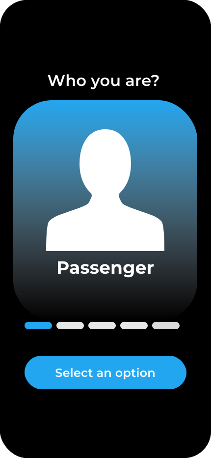
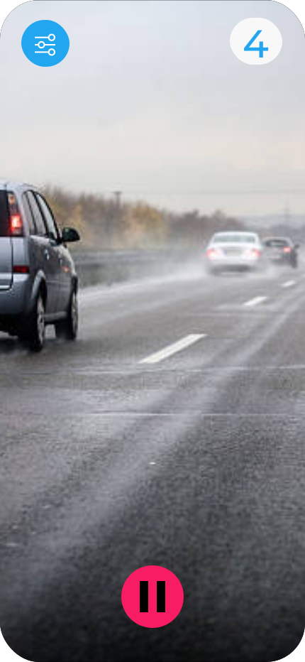
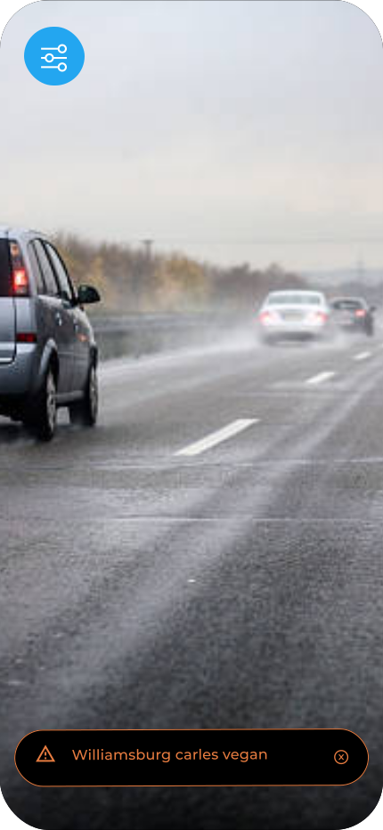

# TrafficSync.io

Intelligent Traffic Registrar: Designed for car drivers, this innovative tool serves as a valuable resource for all participants in road traffic, including bikers, pedestrians, and drivers themselves.

The primary goal of this tool is to notify all participants in traffic about potential accidents based on video input from drivers, recorded by this mobile app video registrar equipped with AI.

Here's a glimpse of the future minimalist app and how it will look:

    
    
    

## How it will works?
(You will know soon)